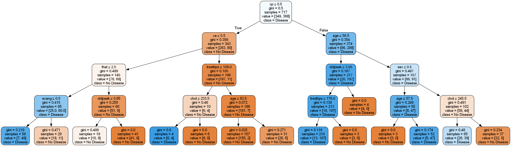

# 🫀 Cart Heart Disease Prediction

Ứng dụng **thuật toán CART (Classification and Regression Trees)**  
trong **phân lớp nguy cơ mắc bệnh tim**

---


---

## 📑 Mục lục
- [📌 Giới thiệu](#-giới-thiệu)
- [📊 Dataset](#-dataset)
- [🧾 Thuộc tính dữ liệu](#-thuộc-tính-dữ-liệu)
- [🔧 Tiền xử lý dữ liệu](#-tiền-xử-lý-dữ-liệu)
- [📈 Phân tích & Trực quan](#-phân-tích--trực-quan)
- [🤖 Mô hình CART](#-mô-hình-cart)
- [🧪 Đánh giá mô hình](#-đánh-giá-mô-hình)

---

## 📌 Giới thiệu
Dự án này xây dựng **mô hình chẩn đoán bệnh tim** dựa trên **cây quyết định (Decision Tree – CART)**, áp dụng đầy đủ quy trình **KDD (Knowledge Discovery in Database)**.

🎯 **Mục tiêu chính:**
- Áp dụng thuật toán CART vào bài toán y tế
- Phân tích dữ liệu lâm sàng bệnh tim
- Xây dựng mô hình **dễ diễn giải – trực quan – phù hợp thực tế**

---

## 📊 Dataset
- 📌 **Nguồn:** Kaggle  
- 🔗 https://www.kaggle.com/datasets/johnsmith88/heart-disease-dataset  
- 📄 **File:** `heart.csv`

### Tổng quan
- 1025 bản ghi
- 14 thuộc tính đầu vào
- 1 biến mục tiêu `target`
  - `0` → Không mắc bệnh tim
  - `1` → Có bệnh tim

Dataset được tổng hợp từ **Cleveland Heart Disease Database** – bộ dữ liệu chuẩn trong y sinh.

---

## 🧾 Thuộc tính dữ liệu (rút gọn)
| Thuộc tính | Mô tả |
|----------|------|
| age | Tuổi |
| sex | Giới tính |
| cp | Loại đau ngực |
| trestbps | Huyết áp lúc nghỉ |
| chol | Cholesterol |
| thalach | Nhịp tim tối đa |
| oldpeak | ST depression |
| ca | Số mạch vành bị hẹp |
| thal | Thalassemia |
| target | Nhãn bệnh tim |

---

## 🔧 Tiền xử lý dữ liệu
✔ Không có giá trị thiếu  
✔ Dữ liệu đã ở dạng số  

### Rời rạc hóa (Discretization)
Nhằm tăng khả năng diễn giải và phù hợp y khoa:

| Thuộc tính | Nhóm |
|----------|-----|
| age | ≤45, 45–55, 55–65, >65 |
| trestbps | ≤120, 120–130, 130–150, >150 |
| chol | ≤200, 200–240, >240 |
| oldpeak | ≤1, 1–2.5, >2.5 |

📁 File sau xử lý:  
`heart_discretized_display.csv`

---

## 📈 Phân tích & Trực quan
Dự án sử dụng:
- Histogram phân bố tuổi
- Boxplot cholesterol
- Heatmap tương quan

📌 Các thuộc tính có ảnh hưởng mạnh:
- `cp`
- `ca`
- `thal`
- `oldpeak`

---

## 🤖 Mô hình CART
Thuật toán:
- **Decision Tree – CART**
- Tiêu chí: `Gini Index`

```python
DecisionTreeClassifier(
    criterion="gini",
    max_depth=4,
    ccp_alpha=0.0001,
    random_state=42
)
```
---

## 🧪 Đánh giá mô hình

Mô hình CART được đánh giá trên **tập test (30%)**, sử dụng các chỉ số phân lớp tiêu chuẩn
trong bài toán phân lớp nhị phân.

### 📊 Kết quả đánh giá

<div align="center">

| Chỉ số | Giá trị |
|------|--------|
| **Accuracy** | **0.86** |
| **Precision** | **0.86** |
| **Recall** | **0.87** |
| **F1-score** | **0.86** |
| **ROC-AUC** | **0.93** |

</div>

### 🩺 Nhận xét
- Mô hình đạt **độ chính xác cao và ổn định** trên tập kiểm tra
- **Recall cao cho lớp “có bệnh tim”** giúp hạn chế bỏ sót bệnh nhân  
- Phù hợp với các bài toán **hỗ trợ chẩn đoán y tế**, nơi Recall quan trọng hơn Accuracy đơn thuần


---

## 🌳 Sơ đồ cây quyết định (CART)

<div align="center">
  
  <p><i>Hình: Sơ đồ cây quyết định CART sử dụng toàn bộ thuộc tính</i></p>
</div>
